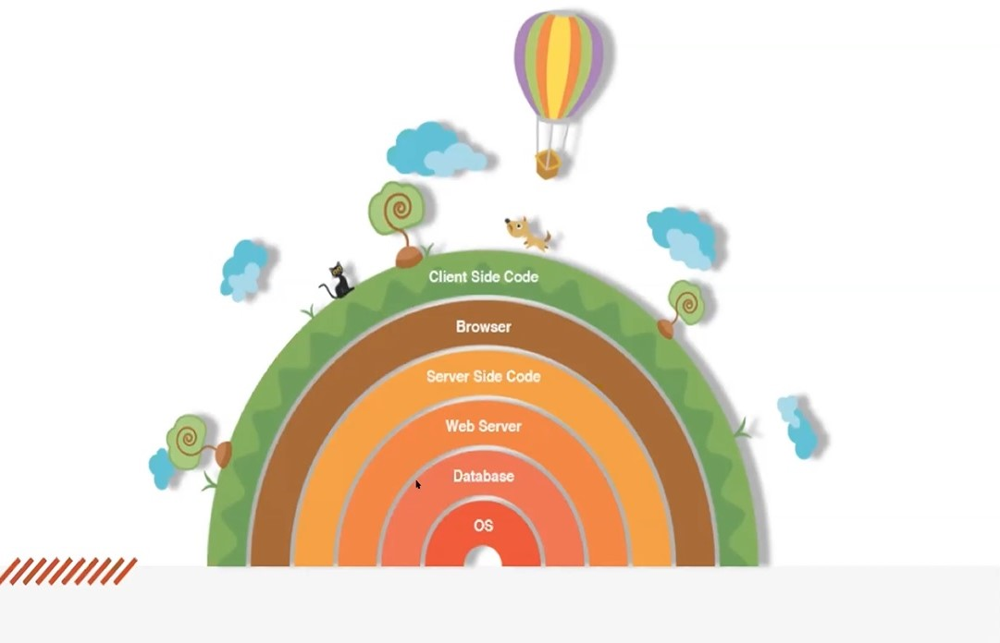

# Text Editors
- Examples
  - Microsoft Word
  - Google Docs
  - Apple Pages
  - ...many more

# Code Editors
- Personal choice
- Allows you to write and manage text that you write to build a website
- Attributes to look for when choosing:
  - Code Completion
    - Start typing, give suggestions
    - Automatic tag closing
    - Emmet - shorthand language (built in or extension), speeds up code writing
- Examples
  - GitHub's Atom
  - Microsoft VS code, Visual Studio
  - Notepad ++
  - Vim, EMacs, Nano, Textmate
  - ...many more

## The Terminal
AKA: The Command Line Interface (CLI)
Basically does the same thing as File Explorer but in a different visual presentation
When you use File Explorer, terminal tasks are actually running behind the scenes

### Examples of commands in Terminal:
- ls = lists all files/folders in directory
- mkdir = make directory
- cd = change directory
- cd .. = go back one directory
- touch = create new file

## Layers of Abstraction
- You won't necessarily know what's happening above or below you
- Ignore those details that are above or below you

